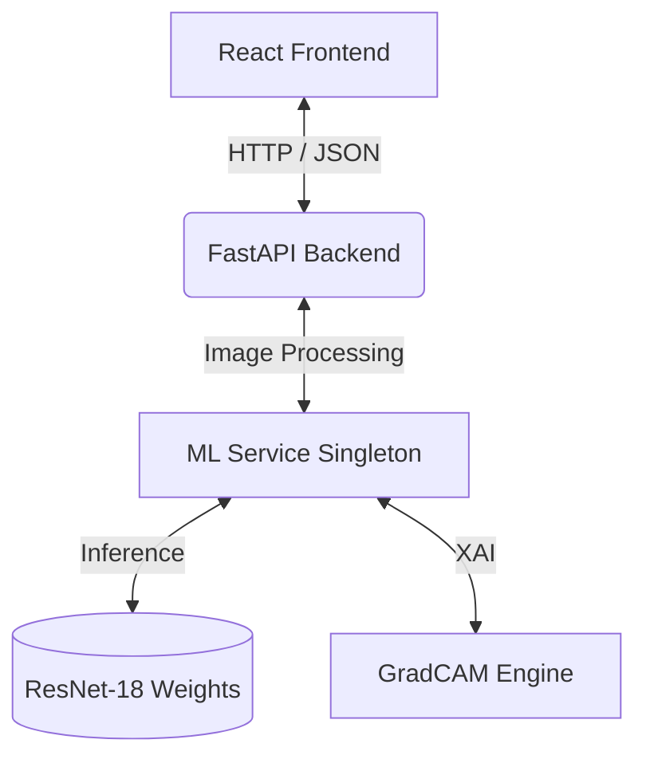

# MedScan AI

MedScan AI is a production-grade, end-to-end Machine Learning healthcare platform designed to accurately detect anomalies such as Pneumonia from Chest X-ray images. Built with an architecture centered around scalability, performance, and clean code principles, the project serves as a showcase of bridging deep learning models into accessible full-stack applications.

## 🚀 Features

- **High-Accuracy CNN Model**: Utilizes a fine-tuned ResNet-18 architecture built with PyTorch.
- **Explainable AI (XAI)**: Implements GradCAM to generate heatmaps, enabling doctors to visually interpret the model's predictions.
- **FastAPI Backend**: A highly performant asynchronous backend designed with clean architecture principles (Controllers, Services, Schemas).
- **React Frontend**: A dynamic user interface built with React, Vite, and TailwindCSS for seamless medical image uploads.
- **Containerized Ecosystem**: Fully Dockerized services orchestratable via Docker Compose for easy deployment.

## 🏗️ Architecture



## 🛠️ Tech Stack

- **Machine Learning**: PyTorch, Torchvision, OpenCV, NumPy
- **Backend**: FastAPI, Uvicorn, Pydantic
- **Frontend**: React, Vite, TailwindCSS
- **Deployment**: Docker, Docker Compose

## 📁 Repository Structure

```
MedScan-AI/
├── backend/          # FastAPI application & ML inference services
│   ├── app/          # Core business logic, schemas, and API routes
│   └── ml/           # Model weights, training, and preprocessing scripts
├── frontend/         # React frontend application
├── datasets/         # Sample data for testing and validation
├── docs/             # Comprehensive documentation
├── scripts/          # Standalone training and evaluation scripts
├── docker-compose.yml
└── README.md
```

## ⚙️ Getting Started

### Prerequisites
- Docker & Docker Compose
- Node.js (for local frontend dev)
- Python 3.9+ (for local backend dev)

### Quick Start (Docker - Recommended)
1. Clone the repository and navigate to the project directory.
2. Build and run the containers:
   ```bash
   docker-compose up --build
   ```
3. Access the interfaces:
   - **Frontend UI**: `http://localhost:5173`
   - **Backend Swagger API**: `http://localhost:8000/docs`

### Local Development (Manual Setup)

**1. Backend Setup**
```bash
cd backend
python -m venv venv
# On Windows: venv\Scripts\activate
# On Mac/Linux: source venv/bin/activate
pip install -r requirements.txt
uvicorn app.main:app --reload --host 127.0.0.1 --port 8000
```

**2. Frontend Setup**
```bash
cd frontend
npm install
# Create a .env file (copy from .env.example)
npm run dev
```

**3. Running Backend Tests**
```bash
cd backend
pytest tests/
```

For detailed local setup, refer to [docs/setup.md](docs/setup.md).

## 📖 Documentation

- [Architecture Diagram and Explanation](docs/architecture.md)
- [API Documentation](docs/api_docs.md)
- [Local Setup Guide](docs/setup.md)

## 🔮 Future Enhancements

- Integrate PostgreSQL for saving patient records and scan histories.
- Implement JWT-based authentication for doctor logins.
- Extend the AI capabilities to recognize additional respiratory diseases.
